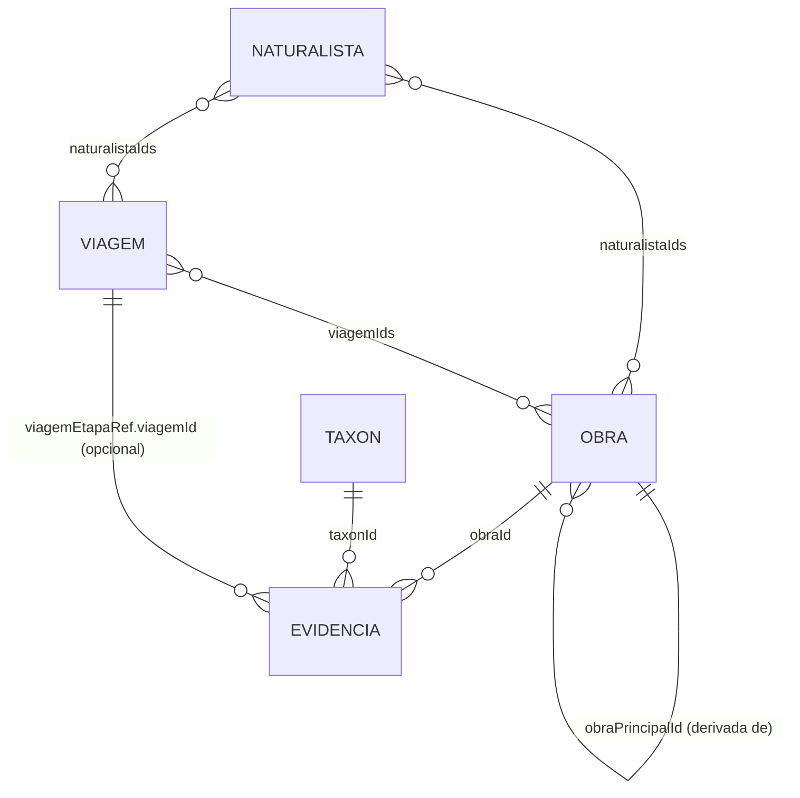

# Modelo de Dados — BioCultNaturalistas

**Feature**: Registro de evidências de biodiversidade e uso tradicional em obras de naturalistas (séc. XVII–XIX)
**Date**: 2026-07-30
**Status**: Completo

## Visão Geral

Este documento define o modelo de dados do BioCultNaturalistas, com base no armazenamento de documentos
JSON sobre SQLite (JSON1, ADR-005 da Arquitetura BioCultural) e nos requisitos funcionais de
`spec.md`. Ele espelha a estrutura de `D:/git/BioCultDB/docs/decisions/data-model.md`, mas diverge do
BioCultDB numa decisão central: em vez de um único doc-raiz (`biocultdb_records`) contendo comunidades e
plantas embutidas, o BioCultNaturalistas usa **cinco tabelas-documento separadas**, ligadas por `id`.

### Por que multi-tabela, não doc-raiz único

No BioCultDB, uma Referência contém `comunidades[]`, que contêm `plantas[]` — tudo em um único documento
JSON. Isso funciona porque uma referência etnobotânica tipicamente cita poucas comunidades e plantas. Uma
obra de naturalista, porém, pode conter **centenas de evidências de uso de biodiversidade** ao longo de
centenas de páginas (ex. Martius, Spruce). Embutir todas as evidências dentro do documento da Obra criaria
um documento de tamanho ilimitado e obrigaria toda consulta por espécie ("todas as evidências deste
táxon, em todas as obras") a varrer `json_each` sobre a tabela inteira. Por isso, o BioCultNaturalistas
normaliza em cinco tabelas-documento independentes — Naturalista, Viagem, Obra, Táxon, Evidência — cada
uma com seu próprio `id`, ligadas por referências lógicas (ids dentro do JSON), não por um único documento
aninhado.

### Prefixo de tabela: `bcn_`

As cinco tabelas usam o prefixo `bcn_`: `bcn_naturalistas`, `bcn_viagens`, `bcn_obras`, `bcn_taxons`,
`bcn_evidencias`. Cada instância do BioCultNaturalistas compartilha o mesmo arquivo SQLite com uma
instância soberana do BioCultTermos (ADR-005 DA1), cujas tabelas usam o prefixo `etnotermos_*`. O prefixo
`bcn_` evita colisão de nomes e deixa inequívoco, a quem inspeciona o arquivo, a qual ferramenta cada
tabela pertence. (Verificado nesta sessão: não há tabela ou referência a `bcn_` no código-fonte do
submodule BioCultTermos hoje.)

### Padrão de tabela-documento

Toda tabela segue **exatamente** o padrão de `D:/git/BioCultDB/backend/src/shared/database.js:63-70`:

```sql
CREATE TABLE IF NOT EXISTS <tabela> (
  id         TEXT PRIMARY KEY,
  doc        TEXT NOT NULL CHECK (json_valid(doc)),
  created_at TEXT NOT NULL,
  updated_at TEXT NOT NULL
);
```

`id` é um UUID v4 gerado pela aplicação (`crypto.randomUUID()`), como em
`D:/git/BioCultDB/backend/src/models/Reference.js:9,17`. Timestamps são strings ISO-8601. Colunas
adicionais são geradas via `ALTER TABLE ... ADD COLUMN <nome> GENERATED ALWAYS AS (json_extract(doc,
'$.<campo>')) VIRTUAL`, criadas de forma idempotente capturando o erro `duplicate column name` — a mesma
técnica de `_ensureGeneratedColumn` em `database.js:97-110`, necessária porque `PRAGMA table_info` não
reflete de forma confiável colunas geradas adicionadas dessa forma.

**Nenhuma tabela tem coluna ou campo `status`.** Diferente de `biocultdb_records.status`
(`pending`/`approved`/`rejected`), não existe workflow de curadoria nesta unidade — decisão registrada
formalmente em ADR-002 (M2). Um registro é publicável no momento em que é gravado.

## Entity Definitions

### 1. Naturalista (`bcn_naturalistas`)

**Purpose**: Representa o naturalista (ou cientista) autor da obra — sua biografia e o contexto
histórico, social e econômico de sua vinda ao Brasil.

**Schema**:
```javascript
{
  id: String,                      // UUID v4
  nome: String,                    // nome usual/citável, ex. "Auguste de Saint-Hilaire" (obrigatório)
  nomeCompleto: String,            // opcional
  nascimento: Number|null,         // ano, inteiro 1500-1900
  falecimento: Number|null,        // ano, inteiro 1500-1950
  nacionalidade: String,           // opcional
  formacao: String,                // ex. "médico", "botânico", "astrônomo" (opcional)
  biografia: String,               // descrição biográfica (opcional, max 20000)
  contextoVinda: {                 // por que e como veio ao Brasil (todos opcionais)
    patrocinio: String,            // ex. "Coroa Portuguesa", "Missão Científica Austríaca"
    missao: String,                // objetivo declarado da vinda
    motivacao: String,
    contextoHistorico: String,     // max 10000
    contextoSocioeconomico: String // max 10000
  },
  periodoNoBrasil: { inicio: Number, fim: Number|null },  // anos; fim null = permaneceu/indefinido
  acervos: [                       // onde os espécimes/manuscritos estão hoje (opcional)
    { instituicao: String, pais: String, tipoAcervo: String, observacoes: String }
  ],
  fontesBiograficas: [String],     // referências usadas para escrever a biografia (opcional)
  createdAt: String,
  updatedAt: String
}
```

**Validation Rules**:
- `nome`: obrigatório, string não vazia, max 300 caracteres
- `nascimento`/`falecimento`: opcionais; se presentes, inteiros; `nascimento` entre 1500-1900,
  `falecimento` entre 1500-1950; quando ambos presentes, `falecimento > nascimento`
- `periodoNoBrasil.inicio`: obrigatório, inteiro 1500-1900; `periodoNoBrasil.fim`: opcional, `null`
  permitido (permanência indefinida), quando presente `>= inicio`
- `acervos[].tipoAcervo`: texto livre alimentado por vocabulário do BioCultTermos (valores esperados:
  `botanico`, `zoologico`, `etnografico`, `paleontologico`, `manuscritos`, `iconografico`) — **não** é
  enum fechado no código, para que o BioCultTermos possa curá-lo como conceito candidato
- `biografia`: opcional, max 20000 caracteres
- `contextoVinda.contextoHistorico`/`contextoSocioeconomico`: opcionais, max 10000 caracteres cada

**Indexes**:
```sql
ALTER TABLE bcn_naturalistas ADD COLUMN nome TEXT GENERATED ALWAYS AS (json_extract(doc,'$.nome')) VIRTUAL;
ALTER TABLE bcn_naturalistas ADD COLUMN periodo_inicio INTEGER GENERATED ALWAYS AS
  (CAST(json_extract(doc,'$.periodoNoBrasil.inicio') AS INTEGER)) VIRTUAL;

CREATE INDEX IF NOT EXISTS idx_bcn_naturalistas_nome ON bcn_naturalistas(nome);
CREATE INDEX IF NOT EXISTS idx_bcn_naturalistas_periodo_inicio ON bcn_naturalistas(periodo_inicio);

-- contexto recebe a concatenação de contextoVinda.* no momento da escrita (mesma técnica de
-- sincronização aplicação-side usada para a coluna `comunidades` em database.js:91)
CREATE VIRTUAL TABLE IF NOT EXISTS bcn_naturalistas_fts USING fts5(
  id UNINDEXED, nome, biografia, contexto,
  tokenize='unicode61 remove_diacritics 2'
);
```

---

### 2. Viagem (`bcn_viagens`)

**Purpose**: Representa o roteiro de viagem de um ou mais naturalistas — a sequência ordenada de
localidades percorridas, ponto de conexão entre a Obra (o relato) e a geografia real da observação.

**Schema**:
```javascript
{
  id: String,
  naturalistaIds: [String],        // min 1; FK lógica → bcn_naturalistas.id
  designacao: String,              // ex. "Viagem Filosófica", "Expedição Langsdorff" (obrigatório)
  anoInicio: Number,               // obrigatório, 1500-1900
  anoFim: Number|null,
  descricao: String,               // max 10000
  meiosDeTransporte: [String],     // opcional, vocabulário BioCultTermos
  distanciaEstimadaKm: Number|null,
  etapas: [                        // roteiro ordenado; min 1
    {
      ordem: Number,               // inteiro >= 1, único dentro da viagem
      ano: Number|null,
      localidadeHistorica: String, // topônimo como aparece na fonte (obrigatório)
      localidadeAtual: String,     // correspondência atual, se conhecida
      estado: String,              // UF atual ou "" se fora do Brasil/desconhecida
      pais: String,                // default "Brasil"
      latitude: Number|null,       // -90..90
      longitude: Number|null,      // -180..180
      precisaoGeografica: String,  // enum: "exata"|"aproximada"|"regiao"|"desconhecida"
      descricao: String,
      povosEncontrados: [String]   // vocabulário BioCultTermos
    }
  ],
  createdAt: String,
  updatedAt: String
}
```

**Validation Rules**:
- `naturalistaIds`: obrigatório, array com pelo menos 1 id existente em `bcn_naturalistas`
- `designacao`: obrigatório, max 300 caracteres
- `anoInicio`: obrigatório, inteiro 1500-1900; `anoFim`: opcional, `null` permitido, quando presente
  `>= anoInicio`
- `etapas`: obrigatório, array com pelo menos 1 etapa
- `etapas[].ordem`: obrigatório, inteiro `>= 1`, **único** dentro do array `etapas` da mesma viagem
- `etapas[].localidadeHistorica`: obrigatório, max 300 caracteres
- `etapas[].pais`: default `"Brasil"` quando ausente
- `etapas[].latitude`/`longitude`: opcionais; quando presentes, `latitude` em `[-90, 90]`, `longitude`
  em `[-180, 180]`
- `etapas[].precisaoGeografica`: **único enum fechado desta entidade**:
  `"exata"|"aproximada"|"regiao"|"desconhecida"`. Obrigatório sempre que `latitude`/`longitude`
  estiverem preenchidos; quando as coordenadas são `null`, o valor é obrigatoriamente `"desconhecida"`.
  Razão: sem este campo, uma coordenada inferida a partir de um topônimo histórico ficaria
  indistinguível de uma coordenada de fato registrada pelo naturalista — o que quebraria o requisito de
  "registro fiel e preciso" da vinda dos naturalistas ao Brasil.

**Indexes**:
```sql
ALTER TABLE bcn_viagens ADD COLUMN ano_inicio INTEGER GENERATED ALWAYS AS
  (CAST(json_extract(doc,'$.anoInicio') AS INTEGER)) VIRTUAL;
ALTER TABLE bcn_viagens ADD COLUMN designacao TEXT GENERATED ALWAYS AS
  (json_extract(doc,'$.designacao')) VIRTUAL;

CREATE INDEX IF NOT EXISTS idx_bcn_viagens_ano_inicio ON bcn_viagens(ano_inicio);
CREATE INDEX IF NOT EXISTS idx_bcn_viagens_designacao ON bcn_viagens(designacao);
```

---

### 3. Obra (`bcn_obras`)

**Purpose**: Representa a referência — o relato ou obra publicada de um naturalista — incluindo edições
derivadas (reedições, traduções, estudos comentados), pela auto-relação `obraPrincipalId`.

**Schema**:
```javascript
{
  id: String,
  tipoRelacao: String,             // enum: "principal"|"reedicao"|"traducao"|"comentada"|"estudo"|"fac-simile"
  obraPrincipalId: String|null,    // null se e somente se tipoRelacao === "principal"
  citacaoClassica: String,         // citação bibliográfica completa, como se cita a obra (obrigatório, max 1000)
  titulo: String,                  // obrigatório, max 500
  subtitulo: String,
  autoresObra: [String],           // autoria desta obra específica (min 1) — inclui editores/tradutores/comentadores
  naturalistaIds: [String],        // naturalista(s) cuja observação a obra veicula (min 1)
  ano: Number,                     // ano desta edição (obrigatório, 1500-2100)
  anoOriginal: Number|null,        // ano da obra principal, quando esta é derivada
  localPublicacao: String,
  editora: String,
  idioma: String,                  // ISO 639-1, ex. "la", "de", "fr", "en", "pt" (obrigatório)
  volumes: Number|null,
  viagemIds: [String],             // viagens que a obra relata (pode ser vazio)
  identificadores: { doi: String, isbn: String, bhlId: String, urlDigitalizacao: String, arquivo: String },
  naturezaDoRegistro: [String],    // vocabulário BioCultTermos; esperados: "botanica","zoologica",
                                    // "etnografica","linguistica","geografica","paleontologica","medica"
  observacoes: String,
  createdAt: String,
  updatedAt: String
}
```

**Validation Rules** (validação de aplicação — não há FK real: `foreign_keys=ON` do SQLite não alcança
ids dentro de colunas JSON):
- `tipoRelacao`: obrigatório, enum `"principal"|"reedicao"|"traducao"|"comentada"|"estudo"|"fac-simile"`
- `tipoRelacao === "principal"` ⟺ `obraPrincipalId === null`. Qualquer outro valor de `tipoRelacao`
  exige `obraPrincipalId` apontando para uma obra existente **cujo** `tipoRelacao` seja `"principal"` —
  hierarquia de um único nível, sem derivada de derivada. Violação de qualquer lado desta regra é erro
  de validação, nunca gravação parcial.
- Uma obra com uma ou mais derivadas apontando para ela (`obraPrincipalId === esta.id`) **não pode ser
  excluída** enquanto essas derivadas existirem.
- `citacaoClassica`: obrigatório, max 1000 caracteres
- `titulo`: obrigatório, max 500 caracteres
- `autoresObra`: obrigatório, array com pelo menos 1 nome
- `naturalistaIds`: obrigatório, array com pelo menos 1 id existente em `bcn_naturalistas`
- `ano`: obrigatório, inteiro 1500-2100
- `idioma`: obrigatório, código ISO 639-1 (2 letras)
- `naturezaDoRegistro`: array (pode ser vazio no schema, mas a aplicação recomenda pelo menos 1 valor);
  é a resposta ao requisito "os dados podem variar grandemente conforme o registro do naturalista" — a
  obra declara **quais dimensões** cobre, permitindo que a Apresentação não prometa dados que a fonte
  não tem

**Indexes**:
```sql
ALTER TABLE bcn_obras ADD COLUMN tipo_relacao TEXT GENERATED ALWAYS AS
  (json_extract(doc,'$.tipoRelacao')) VIRTUAL;
ALTER TABLE bcn_obras ADD COLUMN obra_principal_id TEXT GENERATED ALWAYS AS
  (json_extract(doc,'$.obraPrincipalId')) VIRTUAL;
ALTER TABLE bcn_obras ADD COLUMN ano INTEGER GENERATED ALWAYS AS
  (CAST(json_extract(doc,'$.ano') AS INTEGER)) VIRTUAL;

CREATE INDEX IF NOT EXISTS idx_bcn_obras_tipo_relacao ON bcn_obras(tipo_relacao);
CREATE INDEX IF NOT EXISTS idx_bcn_obras_obra_principal_id ON bcn_obras(obra_principal_id);
CREATE INDEX IF NOT EXISTS idx_bcn_obras_ano ON bcn_obras(ano);

CREATE VIRTUAL TABLE IF NOT EXISTS bcn_obras_fts USING fts5(
  id UNINDEXED, titulo, citacaoClassica, autores,
  tokenize='unicode61 remove_diacritics 2'
);
```

---

### 4. Táxon (`bcn_taxons`)

**Purpose**: Representa a espécie citada em uma ou mais obras, com o nome exatamente como grafado na
fonte histórica e, separadamente, o nome científico aceito atualmente.

**Schema**:
```javascript
{
  id: String,
  nomeCientificoObra: String,      // nome exatamente como grafado na obra (obrigatório, max 300)
  autoriaNomeObra: String,         // autoria do nome como aparece na obra
  nomeCientificoAtual: String,     // nome aceito atual — ENTRADA MANUAL, sem lookup externo
  familiaAtual: String,
  statusNomenclatural: String,     // enum: "aceito"|"sinonimo"|"nao_resolvido"|"nao_verificado"
  reino: String,                   // enum: "Plantae"|"Fungi"|"Animalia"|"outro"
  nomesVernaculares: [
    { nome: String, idioma: String, povo: String, obraId: String }  // nome obrigatório; demais opcionais
  ],
  observacoes: String,
  createdAt: String,
  updatedAt: String
}
```

**Validation Rules**:
- `nomeCientificoObra`: obrigatório, max 300 caracteres
- `nomeCientificoAtual`: **entrada manual, texto livre — sem lookup online em Flora e Funga do
  Brasil/GBIF.** Decisão de produto (ver ADR-002 M5): zero dependência de rede/segredo/cache, imagem
  Docker menor (`docs/principiosDesenvolvimento.md:16`) — a ausência de resolução automática é decisão,
  não lacuna. **Não** é vocabulário controlado do BioCultTermos: nomenclatura científica está fora do
  escopo do vocabulário da federação
  (`Arquitetura-BioCultural/docs/architecture-decisions/ADR-014-nomenclatura-cientifica-fora-do-vocabulario.md`,
  N1, N3) — o campo permanece dado de primeira classe de `bcn_taxons` (ADR-014 N2). Só
  `nomesVernaculares[].nome` é acumulado pelo BioCultTermos como conceito candidato; a convergência
  entre os dois nomes se dá por co-ocorrência no mesmo registro do táxon (ADR-014 N4), não por conceito
  espelho local.
- `statusNomenclatural`: enum `"aceito"|"sinonimo"|"nao_resolvido"|"nao_verificado"`; default
  `"nao_verificado"` quando `nomeCientificoAtual` está vazio
- `reino`: enum `"Plantae"|"Fungi"|"Animalia"|"outro"`
- `nomesVernaculares[].nome`: obrigatório quando o item existe no array; demais subcampos opcionais
- **Deduplicação**: um táxon é único por `nomeCientificoObra` **normalizado** (trim, colapso de espaços
  múltiplos, minúsculas, diacríticos removidos). Duas obras que grafam exatamente o mesmo nome
  reaproveitam o mesmo registro de táxon (adicionam evidências a ele); grafias diferentes do mesmo táxon
  biológico geram registros de `bcn_taxons` distintos, unidos apenas por `nomeCientificoAtual` igual —
  a aplicação **não** funde esses registros automaticamente.

**Indexes**:
```sql
ALTER TABLE bcn_taxons ADD COLUMN nome_obra TEXT GENERATED ALWAYS AS
  (json_extract(doc,'$.nomeCientificoObra')) VIRTUAL;
ALTER TABLE bcn_taxons ADD COLUMN nome_atual TEXT GENERATED ALWAYS AS
  (json_extract(doc,'$.nomeCientificoAtual')) VIRTUAL;
ALTER TABLE bcn_taxons ADD COLUMN reino TEXT GENERATED ALWAYS AS
  (json_extract(doc,'$.reino')) VIRTUAL;

CREATE INDEX IF NOT EXISTS idx_bcn_taxons_nome_obra ON bcn_taxons(nome_obra);
CREATE INDEX IF NOT EXISTS idx_bcn_taxons_nome_atual ON bcn_taxons(nome_atual);
CREATE INDEX IF NOT EXISTS idx_bcn_taxons_reino ON bcn_taxons(reino);

CREATE VIRTUAL TABLE IF NOT EXISTS bcn_taxons_fts USING fts5(
  id UNINDEXED, nomeObra, nomeAtual, vernaculares,
  tokenize='unicode61 remove_diacritics 2'
);
```

---

### 5. Evidência (`bcn_evidencias`)

**Purpose**: A entidade central do BioCultNaturalistas — o trecho transcrito de uma obra que evidencia o
uso de uma espécie pela sociedade da época, com seu contexto geográfico e sociocultural. É por esta
entidade, e não por uma relação direta, que um Táxon se associa a uma Obra.

**Schema**:
```javascript
{
  id: String,
  obraId: String,                  // obrigatório; FK lógica → bcn_obras.id
  taxonId: String,                 // obrigatório; FK lógica → bcn_taxons.id
  viagemEtapaRef: { viagemId: String, etapaOrdem: Number }|null,  // onde/quando foi observado
  citacaoNaObra: { volume: String, pagina: String, prancha: String },
  trechoTranscrito: String,        // transcrição literal do trecho-fonte (obrigatório, max 5000)
  traducaoTrecho: String,          // tradução pt-BR, quando a obra é em outro idioma
  usos: [                          // min 1
    {
      categoriaUso: String,        // obrigatório; vocabulário BioCultTermos (ex. "medicinal","alimentar",
                                    // "ritual","tecnologico","tintorial","construcao","veneno")
      descricaoUso: String,        // obrigatório, max 2000
      partesUsadas: [String],      // vocabulário BioCultTermos (ex. "raiz","folha","casca","fruto","semente","latex")
      modoDePreparo: String
    }
  ],
  contextoGeografico: {
    localidadeHistorica: String, localidadeAtual: String, estado: String, pais: String  // pais default "Brasil"
  },
  contextoSociocultural: {
    povosOuComunidades: [String],  // vocabulário BioCultTermos; designação atual/aceita
    designacaoNaObra: String,      // como o naturalista nomeou o povo (frequentemente pejorativo/arcaico)
    observacoes: String
  },
  confiabilidade: String,          // enum: "explicita"|"inferida"
  sensibilidade: String,           // enum: "publico"|"restrito"
  createdAt: String,
  updatedAt: String
}
```

**Validation Rules**:
- `obraId`: obrigatório, deve existir em `bcn_obras`
- `taxonId`: obrigatório, deve existir em `bcn_taxons`
- `viagemEtapaRef`: opcional; quando presente, `viagemId` deve existir em `bcn_viagens` e `etapaOrdem`
  deve corresponder a uma etapa existente dentro de `bcn_viagens.etapas` daquela viagem
- `trechoTranscrito`: obrigatório, max 5000 caracteres
- `usos`: obrigatório, array com pelo menos 1 item; `usos[].categoriaUso` e `usos[].descricaoUso` são
  obrigatórios por item
- `confiabilidade`: **obrigatório, sem default**, enum `"explicita"|"inferida"`. `"explicita"` quando o
  uso está afirmado no `trechoTranscrito`; `"inferida"` quando é interpretação de quem sistematiza. Não
  ter default força a escolha explícita a cada registro — é o que sustenta o requisito de "registro
  fiel e preciso" pedido para esta ferramenta. A Apresentação exibe o rótulo junto à evidência.
- `sensibilidade`: enum `"publico"|"restrito"`, default `"publico"`. Este é o **tratamento operacional de
  C.A.R.E. sem CLPI** deixado como decisão de produto pendente pelo ADR-001 ponto 10 e por
  `integracao.md` §2.5 — fechado por ADR-002 (M8). `"restrito"` remove a evidência do endpoint
  `/api/federation/records` e da busca pública (contexto Apresentação), mantendo-a acessível apenas no
  contexto Registro. O campo `contextoSociocultural.designacaoNaObra` existe pelo mesmo motivo ético:
  preservar o termo histórico como dado fiel da fonte, sem promovê-lo a designação corrente do povo —
  essa distinção fica em `contextoSociocultural.povosOuComunidades` (vocabulário curado).
- `contextoGeografico` coexiste com `viagemEtapaRef` **sem ser redundância**: muitas obras relatam um
  uso sem localizar a observação numa etapa específica do roteiro de viagem, e o inverso também ocorre
  (etapa conhecida, mas a localidade do uso relatado diverge da etapa). Quando ambos existem e divergem,
  `contextoGeografico` prevalece na apresentação da evidência.

**Indexes**:
```sql
ALTER TABLE bcn_evidencias ADD COLUMN obra_id TEXT GENERATED ALWAYS AS
  (json_extract(doc,'$.obraId')) VIRTUAL;
ALTER TABLE bcn_evidencias ADD COLUMN taxon_id TEXT GENERATED ALWAYS AS
  (json_extract(doc,'$.taxonId')) VIRTUAL;
ALTER TABLE bcn_evidencias ADD COLUMN sensibilidade TEXT GENERATED ALWAYS AS
  (json_extract(doc,'$.sensibilidade')) VIRTUAL;
ALTER TABLE bcn_evidencias ADD COLUMN confiabilidade TEXT GENERATED ALWAYS AS
  (json_extract(doc,'$.confiabilidade')) VIRTUAL;

CREATE INDEX IF NOT EXISTS idx_bcn_evidencias_obra_id ON bcn_evidencias(obra_id);
CREATE INDEX IF NOT EXISTS idx_bcn_evidencias_taxon_id ON bcn_evidencias(taxon_id);
CREATE INDEX IF NOT EXISTS idx_bcn_evidencias_sensibilidade ON bcn_evidencias(sensibilidade);
CREATE INDEX IF NOT EXISTS idx_bcn_evidencias_confiabilidade ON bcn_evidencias(confiabilidade);
CREATE INDEX IF NOT EXISTS idx_bcn_evidencias_obra_taxon ON bcn_evidencias(obra_id, taxon_id);

-- usos, povos e localidades recebem a concatenação dos respectivos arrays na escrita,
-- mesma técnica da coluna `comunidades` em database.js:91
CREATE VIRTUAL TABLE IF NOT EXISTS bcn_evidencias_fts USING fts5(
  id UNINDEXED, trecho, traducao, usos, povos, localidades,
  tokenize='unicode61 remove_diacritics 2'
);
```

---

## Data Relationships



**Cardinalidade**:
- 1 Naturalista participa de 0-n Viagens e é autor/fonte de 1-n Obras
- 1 Viagem tem 1-n Naturalistas e é relatada por 0-n Obras
- 1 Obra tem 1-n Naturalistas, 0-n Viagens, e 0-1 obra principal (`obraPrincipalId`); uma Obra
  `"principal"` pode ter 0-n Obras derivadas apontando para ela
- 1 Obra tem 0-n Evidências; 1 Táxon tem 0-n Evidências
- 1 Evidência referencia exatamente 1 Obra e exatamente 1 Táxon, e opcionalmente 1 etapa de 1 Viagem
- Todas as relações são **containment lógico por id dentro de JSON**, nunca FK nativa do SQLite

## Integridade referencial

Nenhuma relação entre as cinco tabelas é uma foreign key real do SQLite — `PRAGMA foreign_keys = ON`
(herdado do padrão BioCultDB) não alcança ids referenciados de dentro de uma coluna `doc` JSON. Toda
integridade é, portanto, **validada pela aplicação**, na camada de `services/validation.js`, antes de
qualquer escrita. A lista completa de checagens:

1. **Existência de `bcn_naturalistas.naturalistaIds`**: todo id em `naturalistaIds` (de Viagem ou Obra)
   deve existir em `bcn_naturalistas`.
2. **Existência de `bcn_obras.obraId`**: todo `obraId` referenciado por uma Evidência deve existir em
   `bcn_obras`.
3. **Existência de `bcn_taxons.taxonId`**: todo `taxonId` referenciado por uma Evidência deve existir em
   `bcn_taxons`.
4. **Existência de `viagemIds`**: todo id em `bcn_obras.viagemIds` deve existir em `bcn_viagens`.
5. **Coerência `tipoRelacao` ↔ `obraPrincipalId`**: `tipoRelacao === "principal"` ⟺
   `obraPrincipalId === null`; quando não-nulo, deve apontar para uma Obra existente com
   `tipoRelacao === "principal"` (hierarquia de um único nível).
6. **`etapaOrdem` existente na viagem referida**: quando `bcn_evidencias.viagemEtapaRef` está presente,
   `viagemId` deve existir em `bcn_viagens` e `etapaOrdem` deve corresponder a um item existente em
   `bcn_viagens.etapas` daquela viagem.
7. **Bloqueio de exclusão com dependentes**: uma Obra não pode ser excluída enquanto (a) houver Obras
   derivadas apontando para ela via `obraPrincipalId`, ou (b) houver Evidências com `obraId` igual ao
   seu id. Um Táxon não pode ser excluído enquanto houver Evidências com `taxonId` igual ao seu id. Uma
   Viagem não pode ser excluída enquanto houver Obras com essa viagem em `viagemIds`, ou Evidências cujo
   `viagemEtapaRef.viagemId` a referencie. Um Naturalista não pode ser excluído enquanto houver Viagens
   ou Obras que o referenciem em `naturalistaIds`.

Toda violação destas regras é rejeitada com erro de validação antes da escrita — nunca há gravação
parcial ou estado inconsistente entre tabelas.
