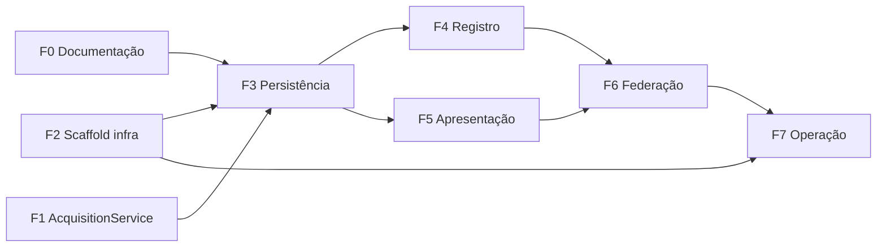

# Roadmap — BioCultNaturalistas

Fases ordenadas de implementação, cada uma com o que entrega e o critério de conclusão observável. Sem
prazos — este documento marca dependências e critérios de pronto, não calendário.

## F0 — Documentação de fundação

**Entrega**: `docs/decisions/data-model.md`, `docs/decisions/spec.md`,
`docs/decisions/ADR-002-modelo-de-dados-e-contextos.md`,
`docs/decisions/ADR-003-fonte-de-vocabulario-bioculttermos.md` e este roadmap.

**Concluída quando**: os cinco documentos existem e não se contradizem entre si nem com
`docs/decisions/ADR-001-integracao-bioculttermos.md` e `integracao.md` já atualizados por esta mesma
sessão de trabalho.

## F1 — Generalização do `AcquisitionService` (BioCultTermos)

**Entrega**: no repositório **BioCultTermos** (não neste), o `AcquisitionService` passa a ler uma lista
de pares `{tabela, campos[]}` de configuração (ADR-003 V1), e os textos fixos da UI do BioCultTermos que
hoje mencionam "BioCultDB" (`backend/src/contexts/admin/views/dashboard.ejs:80`,
`backend/src/contexts/admin/views/acquisition/logs.ejs:24`,
`backend/src/contexts/public/views/about.ejs:17,27,62,85-91`, ver `ADR-001:78-81`) passam a linguagem genérica.

**Bloqueante de F3 em diante** — nenhuma tabela deste repositório pode alimentar vocabulário candidato ao
BioCultTermos antes disso.

**Concluída quando**: o serviço lê a lista `{tabela, campos[]}` de configuração (não mais uma tabela
única hardcoded) e nenhuma view do BioCultTermos menciona "BioCultDB" literalmente.

## F2 — Scaffold de infraestrutura

**Entrega**: submodule `bioculttermos` (`git submodule add https://github.com/edalcin/BioCultTermos.git
bioculttermos`), `docker/Dockerfile.unidade`, `docker/start-unit.sh`,
`.github/workflows/docker-publish.yml`, `.env.example` — todos copiados dos equivalentes do BioCultDB,
com `EXPOSE 3001 3003 4000 4001` (3002 deliberadamente ausente, ADR-002 M7) e
`SQLITE_DB_PATH=/data/unidade.sqlite`.

**Concluída quando**: a imagem builda (`docker build`) e o container sobe os dois processos
(BioCultNaturalistas + BioCultTermos) sem crash, seguindo o padrão fail-fast de `start-unit.sh`.

## F3 — Persistência e modelo

**Entrega**: `backend/src/shared/database.js` com as cinco tabelas (`bcn_naturalistas`, `bcn_viagens`,
`bcn_obras`, `bcn_taxons`, `bcn_evidencias`), suas colunas geradas, índices e tabelas FTS5, exatamente
como especificado em `docs/decisions/data-model.md`; `backend/src/models/*.js` (um por entidade);
`backend/src/services/validation.js` implementando as regras de integridade referencial listadas na
seção "Integridade referencial" de `data-model.md`.

**Depende de**: F1 (o vocabulário candidato só flui se o `AcquisitionService` já sabe ler
`bcn_evidencias`/`bcn_taxons`).

**Concluída quando**: o boot da aplicação cria o schema idempotentemente tanto num arquivo SQLite vazio
quanto num arquivo já criado (segunda execução não lança erro nem duplica coluna/índice/tabela FTS5).

## F4 — Contexto Registro (3001)

**Entrega**: rotas e views EJS+HTMX das cinco entidades (CRUD de Naturalista, Viagem com editor de
etapas, Obra com seletor de obra principal, Táxon com busca-e-reuso) e do formulário de Evidência —
requisitos FR-R01 a FR-R06 de `docs/decisions/spec.md`.

## F5 — Contexto Apresentação (3003)

**Entrega**: páginas de naturalista, obra (com árvore de derivadas), táxon (evidências agregadas),
viagem (roteiro com etapas), busca FTS5 com os seis filtros combináveis, e painel de estatísticas —
requisitos FR-A01 a FR-A07 de `docs/decisions/spec.md`. Aplica a regra de visibilidade FR-V01/FR-V02
(só `sensibilidade: "publico"` na Apresentação).

## F6 — Endpoint de federação

**Entrega**: `GET /api/federation/records` no shape definido por
`D:/git/Arquitetura-BioCultural/docs/architecture-decisions/ADR-004-federated-architecture.md:125-150`
(`{member_id, total, page, records:[{id, visibility, updated_at, data}]}`, paginação obrigatória,
`size` máx. 500), expondo **apenas** evidências `sensibilidade === "publico"` (ADR-002 M8), com `data`
montado a partir da evidência mais os campos desnormalizados da obra, do táxon e do naturalista
referenciados por ela.

## F7 — Operação

**Entrega**: `docs/UNRAID_INSTALLATION.md` e `docs/Manual.md`, espelhando os equivalentes do BioCultDB,
documentando as portas 3001/3003/4000/4001 e a convenção de nome de container
`bioculnaturalistas-<slug-do-projeto>` (`ADR-001:92-95`).

---

## Dependências entre fases

